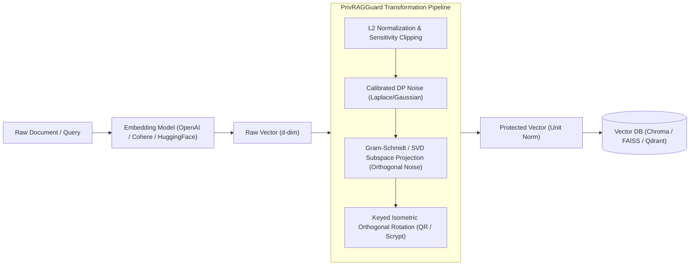

# PrivRAG-Guard — System Architecture



## Stack Architecture

| Component | Technology | Why Chosen | Alternatives Considered | Trade-off / Maintenance |
| :--- | :--- | :--- | :--- | :--- |
| **Core Primitives** | NumPy ($\ge 1.24$) | Vectorized matrix ops, universal standard, zero bloat | PyTorch / TensorFlow | No GPU out-of-the-box, but 0 heavy wheel dependencies |
| **KDF** | `hashlib.scrypt` | Memory-hard key derivation ($N=2^{14}, r=8, p=1$) | PBKDF2 / Argon2 external lib | Standard library native, immune to ASIC cracking |
| **Rotation Gen** | QR Decomposition + Sign Norm | Uniform Haar distribution orthogonal matrix | Givens rotations / Random Walk | $O(d^3)$ one-time cost, cached for subsequent calls |
| **CLI** | `argparse` + ANSI | Zero-dep terminal native, cross-platform ASCII | Click / Rich / Typer | Minimal token footprint, no version conflicts |

## Directory Structure

```
privrag_guard/
├── privrag/
│   ├── __init__.py           # Public exports (PrivRAGGuard, engines)
│   ├── __main__.py           # CLI runner (python -m privrag)
│   ├── cli.py                # Subcommands: attack, benchmark, protect
│   ├── core/
│   │   ├── __init__.py
│   │   ├── dp_engine.py      # Laplace/Gaussian calibrated noise generator
│   │   ├── subspace_proj.py  # SVD principal basis & Gram-Schmidt projector
│   │   └── guard.py          # Vectorized transformation orchestrator
│   ├── adapters/
│   │   ├── __init__.py
│   │   ├── chroma.py         # Chroma collection wrapper
│   │   ├── faiss.py          # Faiss IndexFlatIP wrapper
│   │   ├── langchain.py      # LangChain Embeddings wrapper
│   │   └── qdrant.py         # Qdrant client adapter
│   └── attack_simulator/
│       ├── __init__.py
│       └── inversion.py      # Dictionary inversion attack simulator
├── tests/
│   ├── test_adapters.py      # Chroma, Faiss, LangChain, Qdrant
│   ├── test_attack.py        # Inversion attack test
│   ├── test_cli.py           # CLI invocation and stdout tests
│   ├── test_dp_engine.py     # Noise calibration and bounds
│   ├── test_guard.py         # Cosine preservation, key load/save
│   └── test_subspace.py      # Subspace projection and orthogonality
├── pyproject.toml
└── README.md
```

## Key Invariants
1. **L2 Unit Norm**: Every protected vector $\mathbf{v}'$ satisfies $\|\mathbf{v}'\|_2 = 1.0 \pm 10^{-6}$, ensuring inner product $\langle \mathbf{u}', \mathbf{v}' \rangle = \cos(\theta)$.
2. **Keyed Orthogonality**: Matrix $\mathbf{R}$ satisfies $\mathbf{R}^T \mathbf{R} = \mathbf{I}$, guaranteeing distance and angle preservation between all protected vectors generated with the same key.
3. **Orthogonal Perturbation**: DP noise vector $\mathbf{\eta}^\perp$ satisfies $\langle \mathbf{\eta}^\perp, \mathbf{v} \rangle = 0$, guaranteeing that perturbation does not distort the document's direct semantic direction.
